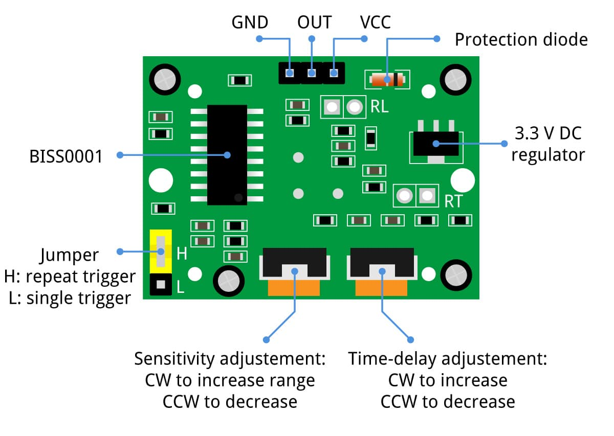

# Lichtschranke
Als erstes ist der Verwendete Sensor keine Lichtschranke sondern ein einfacher Bewegungsmelder, doch da der Projektname sich so eingebürgert hat behalten wir ihn nun.
## Sensor
Der Sensor ist ein HC-S501 PIR sensor. Dieser hat einen Sensorwinkel von 110°, daher erkennt er Bewegungen auch schon sehr früh. Er hat 2 Stellschrauben:

Durch das Einstellen der Stellschrauben kann das Verhalten des Sensors leicht angepasst werden. 
 
## Controller
Als Controller wird ein Leistungsstarker ESP32 in der Variante Dev Module verwendet. Dieser sendet bei einer Bewegung, welche vom Sensor wahrgenommen wird per Serial(USB, Baudrate: 115200) ein string "Trigger" einmalig aus. Danach ist der Controller auf 5sek geprellt und verwirft alle signale vom Sensor. Um einen Upload von der Arduino-IDE durchzuführen muss der BOOT-Knopf gedrückt gehalten werden und ein mal muss vor dem beginn des Uploads bei gedrücktem BOOT-Knopf der RESET-Knopf gedrückt werden. Wenn der Upload abgeschlossen ist, kann der BOOT-Knopf wieder losgelassen werden. 
Um in der Arduino-IDE den Controller zu programmieren benutzen sie  diese Anleitung (https://randomnerdtutorials.com/installing-the-esp32-board-in-arduino-ide-windows-instructions/) und als Target-Board den ESP32 Dev Module

### Verbindung von Sensor und Controller
Um den Controller mit dem Sensor zu verbinden werden 3 Kabel benötigt. Um die Kabel an den Controller anzubringen drehen sie den Controller mit den Pins nach oben und mit dem USB-Anschluss nach vorne. Dann schließen sie das rote Kabel an den Pin ganz oben links an. das schwarze Kabel an den Pin ganz unten rechts und das blaue Kabel an den 9. Pin von unten rechts. 
Nun müssen sie die Kabel an den Sensor anschließen dazu drehen sie die gewölbte seite des Sensors nach unten und lassen die Anschlüsse nach vorn zeigen. Das schwarze Kabel wird links angeschlossen, das rote rechts und das blaue in der Mitte.

Um den Controller per USB mit dem Computer zu verbinden brauchen sie einen Treiber (https://www.silabs.com/developers/usb-to-uart-bridge-vcp-drivers) dieser muss unbedingt installiert sein!

## Software
Um die Software in betrieb zu nehmen istallieren sie bitte die version 3.10 von Python (https://www.python.org/downloads/) Vergessen sie nicht Python zum PATH hinzuzufügen!
Wenn sie Python installiert haben, müssen Sie nun über PIP die benötigten Pakete installieren: 
- https://pypi.org/project/pyserial/
- https://pypi.org/project/Flask/
- https://pypi.org/project/Flask-SocketIO/

Wenn sie alle Pakete installiert haben, starten sie das Programm mit `python3 lichtschranke.py` in Powershell. Dafür öffnen sie Powershell durch die Windows suche, navigieren per cd Befehl in das Verzeichnis und führen den Befehl aus, sollte es zu einem fehlenden Paket kommen, installieren sie dieses.
Um die hilfe über das Programm aufzurufen führen sie `python3 lichtschranke.py help` aus. 
Um alle verfügbaren Controller zu finden führen sie `python3 lichtschranke.py portscan` aus. (Optional auch windows-gerätemanager öffnen und unter COM-Ports nachschauen)
Um sich mit einem Bestimmtem Controller zu verbinden führen sie `python3 lichtschranke.py <COM-Name>` <COM-Name> durch gewünschten Port ersetzen, aus.

Wenn sich das Programm gestartet hat öffnen sie Chrome-Browser und geben sie bei der URL `localhost:3000` ein, dies öffnet das Programm. 
Wenn sie die Testversion öffnen wollen geben sie `localhost:3000/test` ein. 
Wenn sie den Sensor abschalten wollen geben sie `localhost:3000/control` ein.

Um die Software auszuschalten führen sie in Powershell die Tastenkombi STRG+C aus.
